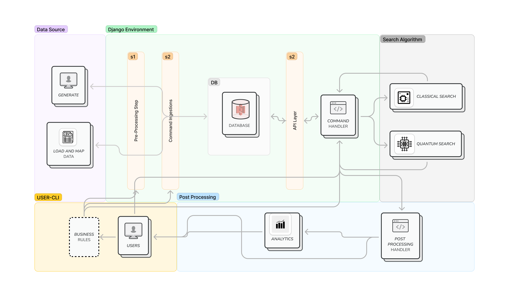

# How to run ?
- Create a virtual environment
- Activate virtual environment
    - Linux
    ```bash
    source venv/bin/activate
    ```
    - Windows
    ```bat
    venv\Scripts\activate.bat
    ```

- Install requirements
    ```bash
    pip3 install -r requirements.txt
    ```
- Make sure to migrate first
    ```bash
    python3 manage.py migrate
    ```
- Generate/Load data or use the existing `db.sqlite3` file.
    - Refer to the [Data Ingestion](#data-ingestion) section below for more details.
- Cancel the flights
    - Use the following command to cancel `x%` of total flight randomly
    ```
    python3 manage.py cancel --percent 0.005
    ```
    - For more controlled cancellation, open the database in `DB Browser for SQLite` and change the status of the flight to `Cancelled` in the `flight_flight` table.
- Run reallocation
    - Use the following command to run the reallocation
    ```
    python3 manage.py allocate --save "result.csv" --config "settings.yml"
    ```
    - This accepts two optional arguments
        - `--save` : to save the result in a csv file, default is `result.csv`
        - `--config` : to specify the config file, default is `settings.yml`
    - For more information on the config file refer to the [Buisness Rules](#buisness-rules) section below.
- Run Post analysis
    - Use the `post_analysis.ipynb` notebook to analyse the results.
    - The second cell contains the file name of the result file, change it accordingly. 
    - Run all!! 


# Data Ingestion
## Data Mapping
This section describes how we mapped the given data to the database tables.
#### Assumptions:
- The `flight_number` is unique for each flight.
- Aircraft's are unique ( from given data mapped using tail number )
- The term `Flight` is used to refer `Inventory`
- Multiple class belongs to a single cabin
- PNR are mapped to class
    - Default cabin to class mapping have been defined
- SSR, value added service etc are mapped to passengers and pnr scores are calculated on the time of ingestion

#### How to run ?
- The `settings.yml` file contains some necessary information for data ingestion. Please strictly follow the format and naming conventions.
    - For more information on the config file refer to the [Buisness Rules](#buisness-rules) section below.

- Run the `flight/management/data/generate_basic.ipynb` to generate some p reprocessed csv files.
- Run the following command to finally ingest data.
```
python3 manage.py flush --noinput && python3 manage.py load_data
```


## Data Generation
This sections describes how we generated data and how to generate data in same way.
- The `settings.yml` file contains some necessary information for data generation. Please strictly follow the format and naming conventions.
    - For more information on the config file refer to the [Buisness Rules](#buisness-rules) section below.
    - The `config["data_generation"]["aircrafts"]` defines the number of aircrafts to be generated 
        - Prn ,Flight counts probabilistic proportional to the number of aircrafts
        - For refference, we created 1100 aircrafts
        - Accordingly it generated 81k+ flight, 5.9M+ pnr and 13.6M+ passengers.
        - Causing 2.5GB+ of data ( takes 1-1:30 hours to generate )

- Run the `flight/management/data/generate.ipynb` to generate some `csv`
    - This will generate the following files
        - `flight/management/data/in-cabin.csv`
        - `flight/management/data/in-class.csv`
        - `flight/management/data/in-ssr.csv`
        - `flight/management/data/in-group.csv`
        - `flight/management/data/in-aircraft.csv`
- Table : `airport`
    - source : `flight/management/commands/in-airport.csv` 
        - [url](https://ourairports.com/countries/IN/airports.hxl)
    - model : Airport
    - table_name: `flight_airport`
    - command: 
    ```python3
    python3 manage.py populate --filename flight/management/data/in-airports.csv --delete
    ```
- Table : `Cabin Types`, `Class Types`, `SSRs`, `Groups`
    - source : 
        - `flight/management/commands/in-cabin.csv`, 
        - `flight/management/commands/in-class.csv`, 
        - `flight/management/commands/in-ssr.csv`, 
        - `flight/management/commands/in-group.csv`
    - model : Cabin, Class, SSR, Group
    - table_name: `flight_cabin`, `flight_class`, `flight_ssr`, `flight_group`
    - command: 
    ```python3
    python3 manage.py populate_baisc
    ```
    - For table cleanup use
    ```python3
    python3 manage.py populate_baic --clean
    ```

- Table : `Aircraft`
    - model : `Aircraft`
    - command:
     ```python3
    python3 manage.py populate_aircraft --clean
    ```  

- Table : `Flight`, `FlightScheuleDate`, `FlightScheule`
    - model : `Flight`, `FlightScheuleDate`, `FlightScheule`
    - command: 
    ```python3
    python3 manage.py populate_flight --clean
    ```
 
- Table : `PNR`, `PnrFlightMapping`, `PnrPassenger`
    - model : PNR, FlightPnrMapping
    - table_name: `flight_pnr`, `flight_flightpnrmapping`
    - command: 
    ```python3
    python3 manage.py populate_pnr
    ```
    - For table cleanup use
    ```python3
    python3 manage.py populate_pnr --clean
    ```

### Note
for data ingestion use this order, first airports, then basic, routes, then pnr

# Buisness Rules
Buiness rules are defined in `settings.yml` file ( or any other file specified in the `--config` argument of the `allocate` command )

#### Note: File extension must be `.yml`
Example config file
```yml
data_generation:
  safe: False # checks before inserting data in db if set True
  aircrafts: 1100
  carriers: 15
  flights_per_aircraft: 15
  flights_per_aircraft_margin: 3
  flight_schedule_prefix : "SCH-ZZ-"
  paid_service: 0.08
  paid_service_score: 200
  loyality_program_score: 2000
  loyality_program: 0.003 # PROBABILITY
  pax_score: 50
  ssr_score: 100
  default_ssr_probability: 0.001
search:
  max_hop : 2 # max limit 2 
  downgrade: True
  upgrade: True
  skip_quantum: False # reduce time ( tries to do the same thing in classical way ) when set True
  use_inventory: False # calculate on inventory instead of capacity
  use_cabin_only: True
  neighboring_search: True # searh using same state airport
scores:
  connecting_score: 100
  default_ssr_score: 200
  default_scd1_score: 300
  default_scd2_score: 200
  cabins:
    F: 2000
    B: 1000
    P: 500
    E: 100
  loyalty:
    Silver: 1000
    Gold: 2000
    Platinum: 3000
```
- There are 3 sections in the config file:
    - **`data_generation`** : contains the parameters for data generation
        - Only used in data generation, can be skipped for pnr allocation
        - All fields are compulsory
    - **`search`** : Contains the parameters for search or pnr reallocation
        - `max_hop` : maximum number of hops/connection allowed
        - `downgrade` : if set to `True` allows downgrading are allowed
        - `upgrade` : if set to `True` allows upgradings are allowed
        - `skip_quantum` : if set to `True` skips the quantum search and uses classical search
        - `use_inventory` : if set to `True` uses avilable inventory instead of avilable capacity
        - `use_cabin_only` : if set to `True` uses cabin only for search (If set to false pnrs should be mapped to class instead of cabin )
        - `neighboring_search` : if set to `True` uses neighboring airports for search, ( Neighboring airports are defined as airports in same state )
    - **`scores`** : This part is important for PNR scoring
        - `connecting_score` : score for connecting flights
        - `default_ssr_score` : score for default ssr
        - `default_scd1_score` : score for default scd1
        - `default_scd2_score` : score for default scd2
        - `cabins` : score for each cabin (edit the class.csv for class level scoring)
        - `loyalty` : score for each loyalty program

# How it works ?
### High Level Schema


### Pnr Ranking


### API Endpoints
#### Note
- These api endpoints were used for our early development and testing.
- Currently these apis are called internally (without http)
- Still can be used for debugging and testing purposes.
- Server must be running to use these apis.
- Run `python3 manage.py runserver` to start the server.
- Host address : `http://127.0.0.1:8000/`
#### API Doc
- `\canclled`
    - Returns the list of cancelled flights
    - Method: `GET`
    - Filters by status = `Cancelled`
    - Sample Response:
    ```json
    {
    "count": 23,
    "data": [
        {
            "flight_id": "INV-ZZ-4593004",
            "departure_airport": "AMD",
            "arrival_airport": "HYD",
            "status": "Cancelled",
            "arrival_time": "2024-05-21T13:37:00Z",
            "departure_time": "2024-05-21T04:59:00Z"
        }, ...
    ]
    }
    ```
- `\pnr_ranking?flight_id={id}`
    - Returns the list of passengers in the flight with the given flight_id
    - Method: `GET`
    - Filters by flight_id
    - Sample Response:
    ```json
    {
    "data": [
        {
            "pnr": "ZAYQ95",
            "score": 20000,
            "class": "R",
            "pax": 9
        },
        {
            "pnr": "BMHR27",
            "score": 16000,
            "class": "R",
            "pax": 7
        },...
    ]
    }
    ```

- `\alt_flight?flight_id={id}`
    - Returns the list of alternative flights for the given flight_id
    - Method: `GET`
    - Filters by flight_id and status = `Scheduled`
    - Sample Response:
    ```json
    {
    "data": [
        {
            "flight_id": "INV-ZZ-9565992",
            "departure_airport": "HYD",
            "arrival_airport": "AMD",
            "status": "Scheduled",
            "arrival_time": "2024-05-22T05:58:00Z",
            "departure_time": "2024-05-21T08:26:00Z",
            "total_avilable_seats": 160,
            "delay": "3:27:00",
            "flight_time": "21:32:00",
            "avilable_seats": {
                "C": 35,
                "R": 56,
                "E": 51,
                "F": 18
            },
            "n_score": 0
        },...
    ],
    "r_flights": [
        {
            "flight_id": "INV-ZZ-4593004",
            "departure_airport": "AMD",
            "arrival_airport": "HYD",
            "status": "Cancelled",
            "arrival_time": "2024-05-21T13:37:00Z",
            "departure_time": "2024-05-21T04:59:00Z"
        }
    ],
    "c_flights": [
        [
            {
                "flight_id": "INV-ZZ-6352197",
                "departure_airport": "AMD",
                "arrival_airport": "MAA",
                "status": "Scheduled",
                "arrival_time": "2024-05-22T16:15:00Z",
                "departure_time": "2024-05-22T13:07:00Z",
                "total_avilable_seats": 141,
                "delay": "1 day, 8:08:00",
                "flight_time": "3:08:00",
                "avilable_seats": {
                    "C": 34,
                    "R": 53,
                    "E": 39,
                    "F": 15
                }
            },
            {
                "flight_id": "INV-ZZ-4861936",
                "departure_airport": "MAA",
                "arrival_airport": "HYD",
                "status": "Scheduled",
                "arrival_time": "2024-05-23T18:28:00Z",
                "departure_time": "2024-05-23T08:12:00Z",
                "total_avilable_seats": 78,
                "delay": "15:57:00",
                "flight_time": "10:16:00",
                "avilable_seats": {
                    "C": 19,
                    "R": 29,
                    "E": 22,
                    "F": 8
                }
            }
        ],...
    ],
    "t_flights": [
        [
            {
                "flight_id": "INV-ZZ-6352197",
                "departure_airport": "AMD",
                "arrival_airport": "MAA",
                "status": "Scheduled",
                "arrival_time": "2024-05-22T16:15:00Z",
                "departure_time": "2024-05-22T13:07:00Z",
                "total_avilable_seats": 141,
                "delay": "1 day, 8:08:00",
                "flight_time": "3:08:00",
                "avilable_seats": {
                    "C": 34,
                    "R": 53,
                    "E": 39,
                    "F": 15
                }
            },
            {
                "flight_id": "INV-ZZ-4277207",
                "departure_airport": "MAA",
                "arrival_airport": "BOM",
                "status": "Scheduled",
                "arrival_time": "2024-05-23T15:50:00Z",
                "departure_time": "2024-05-23T09:56:00Z",
                "total_avilable_seats": 34,
                "delay": "17:41:00",
                "flight_time": "5:54:00",
                "avilable_seats": {
                    "C": 10,
                    "R": 7,
                    "E": 14,
                    "F": 3
                }
            },
            {
                "flight_id": "INV-ZZ-6250134",
                "departure_airport": "BOM",
                "arrival_airport": "HYD",
                "status": "Scheduled",
                "arrival_time": "2024-05-24T05:44:00Z",
                "departure_time": "2024-05-23T16:54:00Z",
                "total_avilable_seats": 218,
                "delay": "1:04:00",
                "flight_time": "12:50:00",
                "avilable_seats": {
                    "C": 50,
                    "R": 72,
                    "E": 68,
                    "F": 28
                }
            }
        ],...
    ]
    }
    ```
    - `data` : list of no-hop flights
    - `r_flights` : list of related cancelled flights ( solution space same )
    - `c_flights` : list of 1-hop flights
    - `t_flights` : list of 2-hop flights